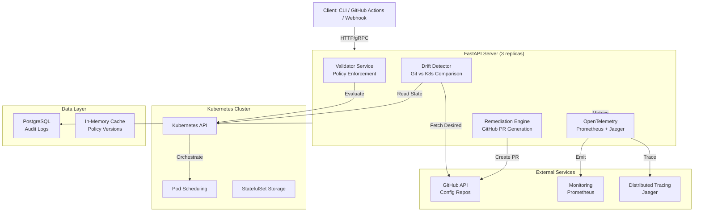
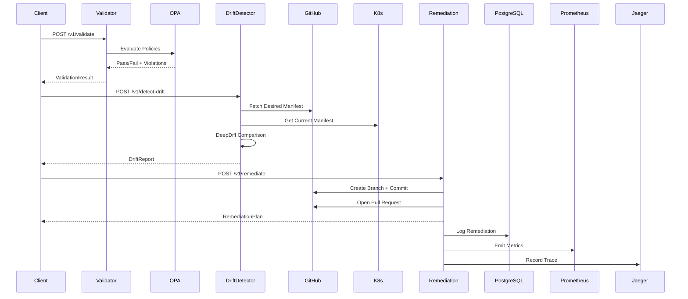
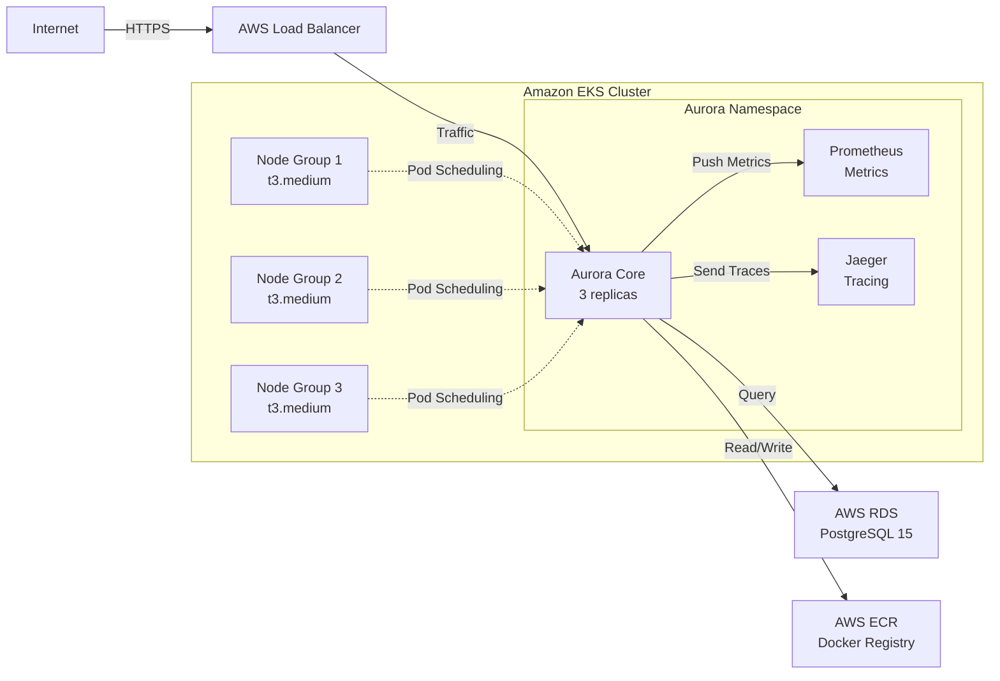

# Aurora Core

Production MLOps infrastructure for deploying and managing AI workloads on Kubernetes with policy enforcement, drift detection, and automated remediation.

## Overview

Aurora Core is a validation and remediation engine built for production AI operations. It enforces security policies at deployment time, detects configuration drift from source of truth, and automatically generates pull requests to fix misconfigurations. Designed for multi-cloud Kubernetes deployments (AWS EKS, GCP GKE, Azure AKS) with zero vendor lock-in.

## System Architecture



## Request Flow Diagram



## Deployment Architecture on AWS



## Quick Start

### Prerequisites

Verify your environment before deployment:

```bash
aws --version                    # AWS CLI v2.x+
kubectl version --client         # kubectl v1.26+
helm version                      # Helm v3.12+
terraform version               # Terraform v1.5+
docker --version                # Docker 24.x+
```

### Deploy to AWS EKS

One-command deployment to AWS with Terraform and Helm:

```bash
./scripts/deploy-aws.sh
```

What this script does:

1. Provisions EKS cluster (3 nodes, t3.medium)
2. Creates RDS PostgreSQL database
3. Sets up VPC with public subnets across 3 AZs
4. Builds Docker image and pushes to ECR
5. Deploys Aurora Core with Helm
6. Configures Prometheus + Jaeger observability
7. Waits for all pods to be ready

Expected duration: 10 to 15 minutes.

### Local Development

For development without AWS infrastructure:

```bash
python3.12 -m venv .venv
source .venv/bin/activate
pip install -e ".[dev]"

pytest tests/unit/ -v          # Run unit tests
pytest tests/integration/ -v   # Run integration tests

python src/aurora/main.py      # Start development server
```

Server runs on http://localhost:8000 with hot-reload enabled.

### Kubernetes (Any Cloud)

Deploy to your existing Kubernetes cluster:

```bash
kubectl create namespace aurora

helm install aurora-core infra/helm/aurora-core \
  --namespace aurora \
  --values infra/helm/aurora-core/values.yaml
```

Verify deployment:

```bash
kubectl rollout status deployment/aurora-core -n aurora
kubectl logs -n aurora -l app=aurora-core -f
```

## API Reference

All endpoints accept JSON and return JSON. Authentication via GitHub token (environment variable).

### POST /v1/validate

Validate Kubernetes manifest against security policies.

Request:

```json
{
  "manifest": {
    "apiVersion": "apps/v1",
    "kind": "Deployment",
    "metadata": {"name": "model-api"},
    "spec": {
      "template": {
        "spec": {
          "containers": [
            {
              "name": "model",
              "image": "model:v1.0",
              "resources": {
                "limits": {"cpu": "1000m", "memory": "512Mi"}
              }
            }
          ]
        }
      }
    }
  },
  "policies": ["rbac", "network_isolation", "resource_limits"]
}
```

Response (200 OK):

```json
{
  "validation_id": "val-a1b2c3d4",
  "status": "passed",
  "violations": [],
  "passed_rules": ["rbac", "network_isolation", "resource_limits"],
  "latency_ms": 45.3,
  "timestamp": "2026-08-18T14:32:15.123456Z"
}
```

Response (200 OK, with violations):

```json
{
  "validation_id": "val-x9y8z7w6",
  "status": "failed",
  "violations": [
    {
      "rule_id": "rbac-001",
      "severity": "critical",
      "message": "ServiceAccount has cluster-admin role",
      "remediation": "Remove cluster-admin, apply namespace-scoped role"
    }
  ],
  "passed_rules": ["network_isolation"],
  "latency_ms": 38.7,
  "timestamp": "2026-08-18T14:32:15.654321Z"
}
```

### POST /v1/detect-drift

Compare current Kubernetes state against desired state from Git repository.

Request:

```json
{
  "current_manifest": {
    "apiVersion": "apps/v1",
    "kind": "Deployment",
    "spec": {"replicas": 3, "image": "model:v1.0"}
  },
  "desired_manifest": {
    "apiVersion": "apps/v1",
    "kind": "Deployment",
    "spec": {"replicas": 3, "image": "model:v1.1"}
  }
}
```

Response (200 OK):

```json
{
  "drift_id": "drift-k3l4m5n6",
  "drift_detected": true,
  "changes": [
    {
      "field": "spec.image",
      "current": "model:v1.0",
      "desired": "model:v1.1",
      "change_type": "value_mismatch"
    }
  ],
  "latency_ms": 125.6,
  "confidence": 0.99,
  "timestamp": "2026-08-18T14:35:22.987654Z"
}
```

### POST /v1/remediate

Generate GitHub pull request to fix configuration drift.

Request:

```json
{
  "drift_report": {
    "changes": [
      {
        "field": "spec.image",
        "current": "model:v1.0",
        "desired": "model:v1.1",
        "change_type": "value_mismatch"
      }
    ]
  },
  "desired_manifest": {
    "apiVersion": "apps/v1",
    "kind": "Deployment",
    "spec": {"replicas": 3, "image": "model:v1.1"}
  },
  "repo_url": "https://github.com/aurora-mlops/config"
}
```

Response (200 OK):

```json
{
  "remediation_id": "rem-p9q8r7s6",
  "status": "proposed",
  "branch_name": "aurora/remediation-rem-p9q8r7s6",
  "pr_url": "https://github.com/aurora-mlops/config/pull/42",
  "timestamp": "2026-08-18T14:36:45.123456Z"
}
```

## Operational Guide

### Accessing Prometheus

Prometheus scrapes Aurora Core metrics every 5 seconds. Access the UI:

```bash
kubectl port-forward -n aurora svc/prometheus 9090:9090
# Open http://localhost:9090
```

Key metrics:

aurora_validation_duration_ms: Histogram of validation latencies
aurora_validation_failures_total: Count of failed validations
aurora_drift_detected_total: Count of drift detections
aurora_remediation_pr_created_total: Count of PRs generated

### Accessing Jaeger Distributed Tracing

Traces all API requests end-to-end through validators, drift detector, and remediation engine:

```bash
kubectl port-forward -n aurora svc/jaeger-ui 16686:16686
# Open http://localhost:16686
```

### Viewing Logs

Stream Aurora Core logs in real time:

```bash
kubectl logs -n aurora -l app=aurora-core -f
```

### Database Connection

Connect to PostgreSQL database for audit log inspection:

```bash
DB_HOST=$(kubectl get secret aurora-db -n aurora -o jsonpath='{.data.host}' | base64 -d)
PGPASSWORD=$(kubectl get secret aurora-db -n aurora -o jsonpath='{.data.password}' | base64 -d) \
  psql -h $DB_HOST -U aurora -d aurora
```

### Scaling Aurora Core

Adjust replica count and resource limits:

```bash
kubectl scale deployment aurora-core -n aurora --replicas 5

kubectl set resources deployment aurora-core \
  -n aurora \
  --limits=cpu=1000m,memory=1Gi \
  --requests=cpu=200m,memory=512Mi
```

## Architecture Decisions

Major design decisions documented in Request For Comments (RFCs):

RFC-0001: Vision for Aurora as production AI infrastructure
RFC-0002: Core architecture using FastAPI, OPA, PostgreSQL

Architecture Decision Records (ADRs):

ADR-0001: Python 3.12 + FastAPI for performance and ecosystem
ADR-0002: Open Policy Agent for declarative policy language
ADR-0003: PostgreSQL for auditability and transactional consistency

## Testing

Run the complete test suite:

```bash
make ci
```

This runs lint, type checking, security scanning, unit tests, and Docker build.

Individual commands:

```bash
make lint          # Ruff linter
make format        # Black formatter
make typecheck     # mypy strict mode
make security      # bandit + safety
make test          # pytest with coverage
make build         # Docker image build
```

Coverage target: 90% minimum.

## Production Considerations

Before running Aurora Core in production, ensure:

1. PostgreSQL is configured with automated backups (7+ day retention)
2. GitHub token is rotated every 90 days
3. Kubernetes RBAC is restricted to minimum required permissions
4. Network policies enforce pod-to-pod communication limits
5. Pod Disruption Budgets maintain 2+ replicas during node maintenance
6. Prometheus retention is set to 15 days minimum
7. Jaeger traces are sampled at 10% in production (100% in staging)

## Support and Documentation

Project documentation:

docs/architecture/: System design and trade-offs
docs/rfc/: Request for Comments (RFC-0001, RFC-0002)
docs/adr/: Architecture Decision Records
docs/threat-models/: Security analysis
docs/deployment/: Deployment guides per cloud provider
docs/api/: OpenAPI specifications

GitHub repository: https://github.com/aurora-mlops/aurora-core
Issue tracker: https://github.com/aurora-mlops/aurora-core/issues
